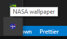
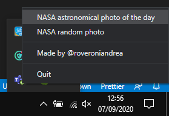
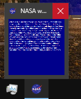

# NASA image of the day wallpaper

This is a simple Electron app to set your Windown 10 / Mac wallpaper to one of **NASA's Astronomical Photo Of the Day**

## Setup

Cone the repo: `git clone https://github.com/roveroniandrea/nasa-wallpaper`

`cd nasa-wallpaper`

Run nodeJS:

`npm install`

`npm start`

## How it works

Calling `npm start` launches the Electron app. This displays a Tray icon in your application bar:

Right click to open the context menu:

The first option is to display the Current Photo of the day, while the second is for chosing a random wallpaper from the past Photos of the Day

## Describing the image

Every image comes with an official description. Left click the icon to show it. To close the description, simply close the window on the application bar:

## Run on startup
I really sugggest you to run this app on startup, so you will always have the latest photo of the day. To do this, simply insert a link to [`setTodayImage.vbs`](./setTodayImage.vbs) on your startup folder
